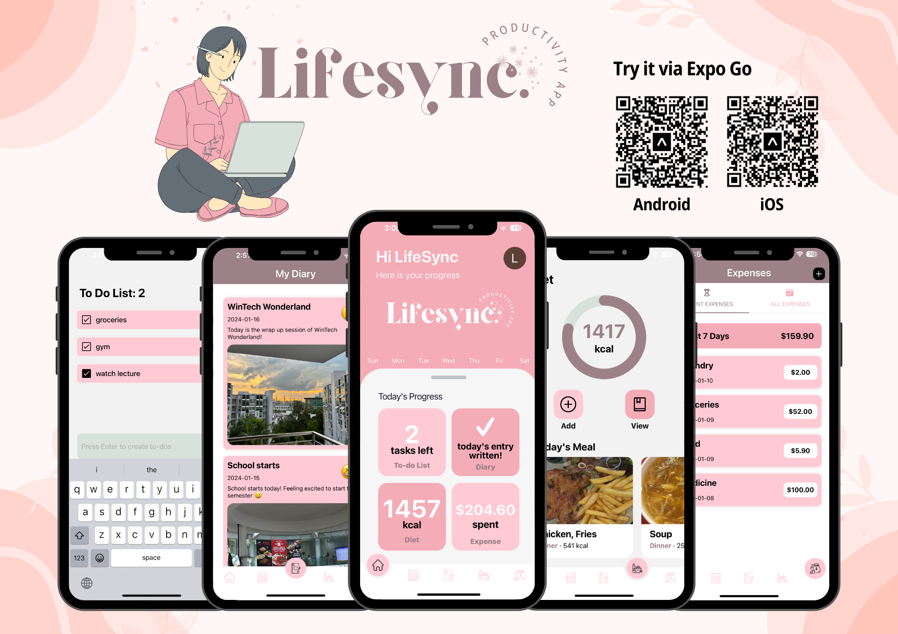

# Lifesync

---

## Description

In the fast-paced modern world, individuals find it challenging to prioritise their personal wellbeing. Whilst there are a multitude of productivity applications, it seems to focus on a singular feature such as to-do list, meal preparation and expense tracker. Hence, Lifesync is an all-in-one application which has features such as a calendar, a diary, diet, expense and habit trackers, improving users’ convenience. 

## Features

- 📆 **Schedule**: Coordinate your schedule using the app in-built calendar. You would also have an option to sync your in-app calendar with your personal Google Calendar. 
- 📕 **Diary**: A personal space to express your thoughts, experiences and reflections for the day through text entries by writing, and visual entries by inserting pictures. 
- 🥗 **Calories Tracking**: Take/upload photos of your meals to LifeSync to track calories via our meal recognition feature.
- 💰 **Expense Tracker**: Simplify expense management by tracking, editing, adding, and deleting expenses with ease. Review all recorded expenses or effortlessly focus on the last 7 days for a quick financial overview.

## Language and Tools Used

 
 
 

- **React Native**:
React Native is a popular open-source framework for building cross-platform mobile applications using JavaScript and React. It allows developers to write code once and deploy it on both iOS and Android platforms, saving time and resources. With a rich ecosystem and a strong community, React Native enables the development of high-performance, native-like mobile apps.

- **Expo**:
Expo is a set of tools and services built around React Native that simplifies the development process for mobile applications. It provides a set of libraries and services for tasks like navigation, camera, and push notifications, allowing developers to focus on building features rather than dealing with the complexities of native development.

- **Clerk**:
Clerk is an authentication and user management service that simplifies the implementation of secure user authentication in web applications. It provides features like multi-factor authentication, passwordless login, and user role management. Clerk helps ensure that Lifesync's user data is handled securely and that the authentication process is seamless for users.

- **Firebase**:
Firebase is a powerful backend-as-a-service (BaaS) platform, seamlessly integrated for data storage and real-time updates.

## Getting Started
1. Install Expo Go on your mobile device / Install Android Simulator on your local machine.
2. Clone the repository to your local machine:
`bash$
   git clone https://github.com/yiwern5/wintech-productivity-app`
3. Install dependencies:
`bash$
    npm install`
4. Run app:
`bash$
    npx expo start`
5. View app by scanning the Expo Go QR code / on Android Simulator.

## Team members
1. Han Zixuan Nancy (@hzxnancy)
2. S Devi Harshitha (@sdevih)
3. Kelly Bong Jia Qi (@Bonzzz3)
4. Tsui Yi Wern (@yiwern5)
